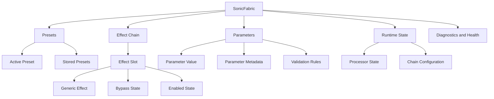
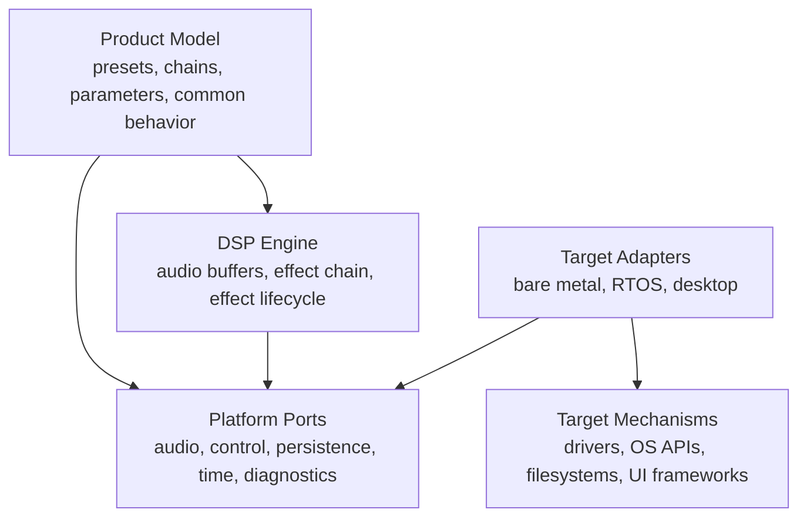
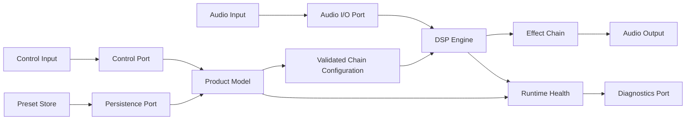
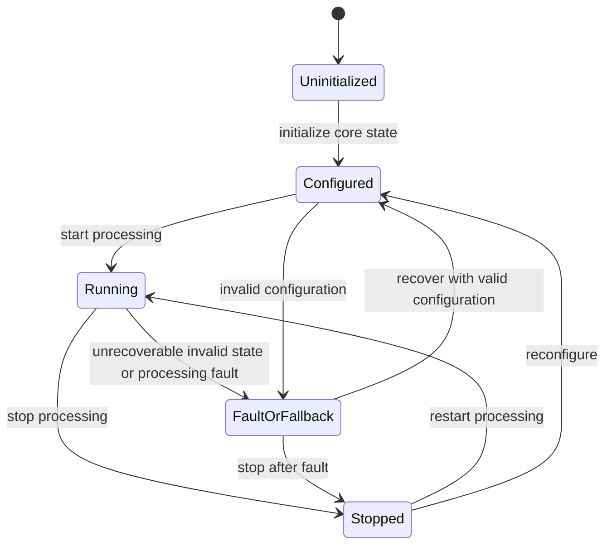
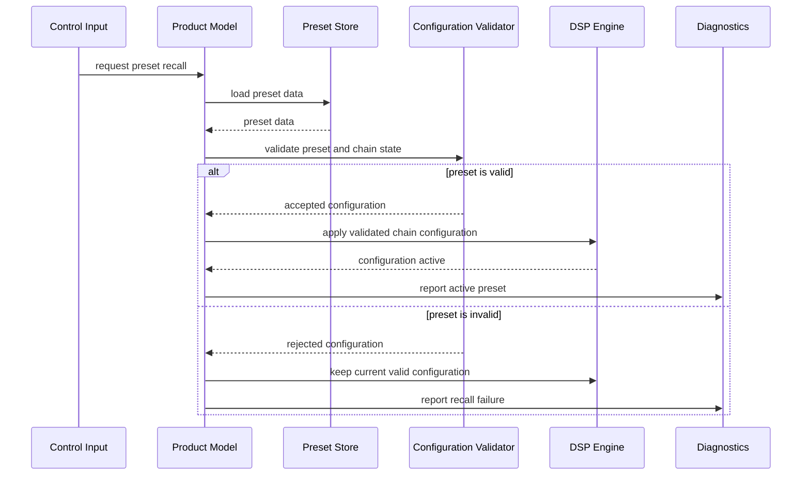
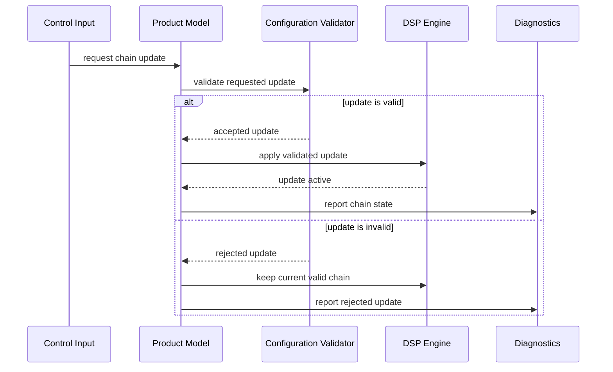

# Architecture Views

## Purpose

The project display name is **SonicFabric**.

This document captures target-neutral product behavior and runtime architecture views for SonicFabric. The diagrams describe expected core behavior shared by bare metal, RTOS, and desktop versions. Target-specific details should be added later only after the shared product behavior is stable.

These views support the architecture principles in [ArchitectureAndDesignPrinciples.md](ArchitectureAndDesignPrinciples.md), the requirements in [ProductAndSoftwareRequirements.md](ProductAndSoftwareRequirements.md), the structural views in [StructuralArchitectureViews.md](StructuralArchitectureViews.md), and the shared vocabulary in [Terminology.md](Terminology.md).

## Product Concept View

This view shows the common product concepts that should remain consistent across targets.

## Layer and Dependency View

This view describes the intended dependency direction. Shared product and DSP behavior should depend on stable platform ports, not on target mechanisms.

## Runtime Audio and Control Flow

This view separates the real-time audio flow from the control/configuration flow. Control changes affect product state and chain configuration, but the audio path remains explicit and bounded.

## Processor State Model

This view describes the common processor lifecycle before any target-specific startup, scheduling, or shutdown mechanism is chosen.

## Preset Recall Flow

This view defines the common behavior expected when a preset is recalled while the product is active.

## Effect Chain Update Flow

This view defines the expected behavior for effect enable, bypass, parameter, and reorder changes.

