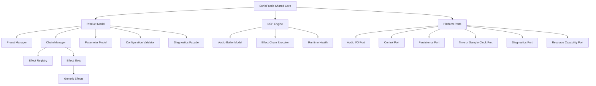
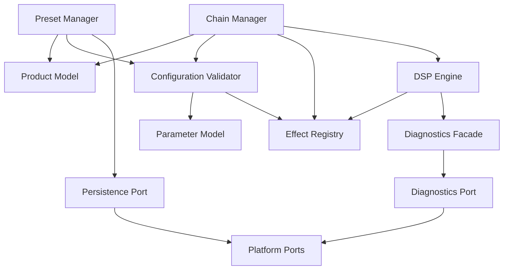
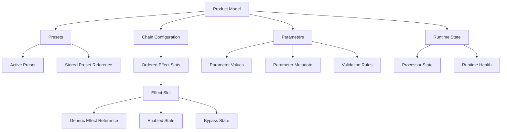
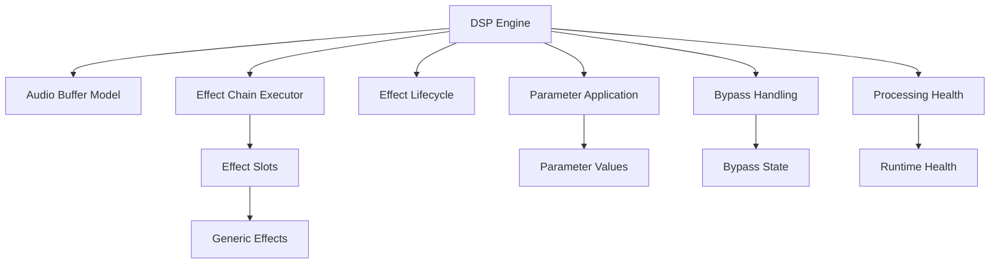
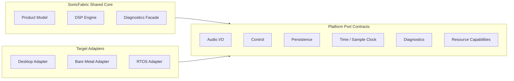

# Structural Architecture Views

## Purpose

The project display name is **SonicFabric**.

This document captures target-neutral static structure for SonicFabric. These views describe the shared components, ownership boundaries, module dependencies, and platform port boundaries that should remain common before target-specific deployment decisions are made.

These views support the architecture principles in [ArchitectureAndDesignPrinciples.md](ArchitectureAndDesignPrinciples.md), the behavior/runtime views in [ArchitectureViews.md](ArchitectureViews.md), the requirements in [ProductAndSoftwareRequirements.md](ProductAndSoftwareRequirements.md), and the shared vocabulary in [Terminology.md](Terminology.md).

## Shared Component View

This view shows the main shared components and their ownership relationships. It is conceptual and does not define concrete classes, files, threads, tasks, interrupts, or processes.

## Shared Module Dependency View

This view shows intended dependency direction between shared modules. Dependencies should point toward stable contracts and avoid direct target mechanisms.

## Product Model Structure

This view shows the static product concepts owned by the product model.

## DSP Engine Structure

This view shows the static responsibilities inside the DSP engine. It does not prescribe algorithms, buffer sizes, memory allocation strategy, or target scheduling.

## Platform Port Boundary View

This view shows the shared core depending on target-neutral port contracts, with target adapters outside the shared core. Target mechanisms remain outside this static structure until target-specific architecture views are created.

## Deferred Target Deployment Views

Deployment and allocation diagrams are deferred until target-specific requirements exist. Future deployment views should describe how the shared core, platform ports, and target adapters map to concrete desktop, bare metal, or RTOS execution environments without redefining common product behavior.
