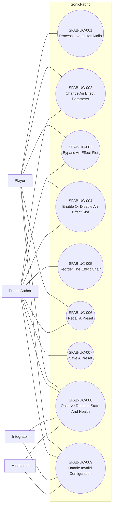
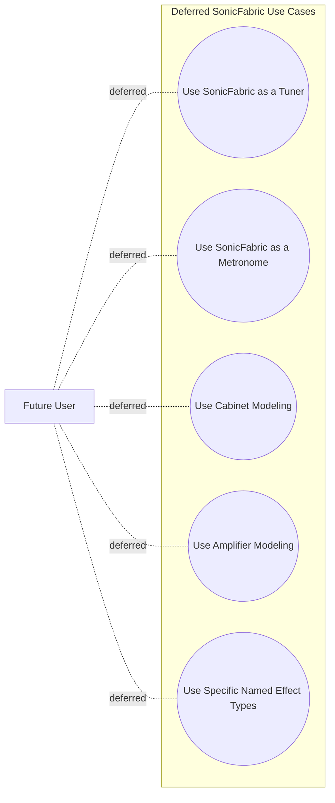

# Use Cases

## Purpose

The project display name is **SonicFabric**.

This document captures user-facing workflows for SonicFabric. It defines what a user or external actor is trying to accomplish, while requirements, architecture views, and interface contracts remain the source of truth for system constraints, behavior details, and component responsibilities.

Related documents:

- [ProductAndSoftwareRequirements.md](ProductAndSoftwareRequirements.md): requirement statements and `SFAB-*` labels.
- [ArchitectureViews.md](ArchitectureViews.md): target-neutral behavior and runtime diagrams.
- [InterfaceContract.md](InterfaceContract.md): behavior-level interface contracts.
- [Terminology.md](Terminology.md): shared vocabulary.

## Use Case Rules

- Use cases describe user goals, not implementation mechanisms.
- Use cases shall not duplicate full requirement text.
- Use cases shall reference related requirements instead of restating them.
- Use cases shall remain target-neutral until target-specific requirements exist.
- Deferred features such as tuner and metronome shall not become use cases until they are promoted into scope.

## Actors

- **Player**: Uses SonicFabric while playing guitar.
- **Preset Author**: Creates, modifies, saves, and recalls product configurations.
- **Integrator**: Connects SonicFabric to a target environment through platform ports and adapters.
- **Maintainer**: Evolves the shared product behavior, DSP model, tests, and target integrations.

## Use Case Diagram

Mermaid does not provide a native UML use-case diagram type, so this view uses a Mermaid flowchart with UML-style actor-to-use-case relationships.

## Deferred Use Case Diagram

These candidates remain outside the current system scope until promoted into requirements.

## Primary Use Cases

### SFAB-UC-001: Process Live Guitar Audio

- **Primary actor**: Player.
- **Goal**: Hear processed guitar audio while playing.
- **Related requirements**: `SFAB-PR-001`, `SFAB-HWR-001`, `SFAB-SQR-PERF-001`, `SFAB-SQR-PERF-002`, `SFAB-SQR-PERF-003`.
- **Notes**: Detailed audio flow is shown in [ArchitectureViews.md](ArchitectureViews.md).

### SFAB-UC-002: Change An Effect Parameter

- **Primary actor**: Player or Preset Author.
- **Goal**: Adjust the sound by changing a parameter exposed by the active configuration.
- **Related requirements**: `SFAB-PR-003`, `SFAB-PR-006`, `SFAB-PR-008`, `SFAB-SQR-USE-001`, `SFAB-SQR-TEST-002`.
- **Notes**: Parameter semantics are defined by the Parameter Contract in [InterfaceContract.md](InterfaceContract.md).

### SFAB-UC-003: Bypass An Effect Slot

- **Primary actor**: Player or Preset Author.
- **Goal**: Temporarily remove an effect slot from the audible chain without removing it from the configuration.
- **Related requirements**: `SFAB-PR-002`, `SFAB-PR-006`, `SFAB-SQR-USE-001`, `SFAB-SQR-REL-003`.
- **Notes**: Bypass behavior is governed by the Effect Chain Execution Contract in [InterfaceContract.md](InterfaceContract.md).

### SFAB-UC-004: Enable Or Disable An Effect Slot

- **Primary actor**: Player or Preset Author.
- **Goal**: Make an effect slot available or unavailable in the active chain.
- **Related requirements**: `SFAB-PR-002`, `SFAB-PR-004`, `SFAB-PR-008`, `SFAB-SQR-MOD-001`, `SFAB-SQR-USE-001`.
- **Notes**: The effect slot concept is defined in [Terminology.md](Terminology.md).

### SFAB-UC-005: Reorder The Effect Chain

- **Primary actor**: Preset Author.
- **Goal**: Change the order in which generic effects are applied.
- **Related requirements**: `SFAB-PR-002`, `SFAB-PR-004`, `SFAB-PR-008`, `SFAB-SQR-MOD-002`, `SFAB-SQR-TEST-002`.
- **Notes**: The target-neutral chain update flow is shown in [ArchitectureViews.md](ArchitectureViews.md).

### SFAB-UC-006: Recall A Preset

- **Primary actor**: Player or Preset Author.
- **Goal**: Make a stored product configuration active.
- **Related requirements**: `SFAB-PR-004`, `SFAB-PR-005`, `SFAB-PR-008`, `SFAB-SQR-REL-001`, `SFAB-SQR-TEST-002`.
- **Notes**: The target-neutral preset recall flow is shown in [ArchitectureViews.md](ArchitectureViews.md).

### SFAB-UC-007: Save A Preset

- **Primary actor**: Preset Author.
- **Goal**: Preserve the current product configuration for later recall.
- **Related requirements**: `SFAB-PR-004`, `SFAB-HWR-005`, `SFAB-SQR-PORT-001`, `SFAB-SQR-TEST-002`.
- **Notes**: Persistence details remain target-specific and are represented through the Persistence Port Contract in [InterfaceContract.md](InterfaceContract.md).

### SFAB-UC-008: Observe Runtime State And Health

- **Primary actor**: Player, Preset Author, Integrator, or Maintainer.
- **Goal**: Understand the active preset, chain configuration, processing health, or rejected operation state.
- **Related requirements**: `SFAB-PR-006`, `SFAB-HWR-006`, `SFAB-SQR-USE-001`, `SFAB-SQR-REL-001`.
- **Notes**: Diagnostics and runtime health contracts are defined in [InterfaceContract.md](InterfaceContract.md).

### SFAB-UC-009: Handle Invalid Configuration

- **Primary actor**: Player, Preset Author, Integrator, or Maintainer.
- **Goal**: Receive predictable behavior when a preset, chain update, effect reference, or parameter value is invalid.
- **Related requirements**: `SFAB-PR-008`, `SFAB-SQR-REL-001`, `SFAB-SQR-REL-003`, `SFAB-SQR-TEST-002`.
- **Notes**: Validation behavior is defined by the Configuration Validation Contract in [InterfaceContract.md](InterfaceContract.md).

## Deferred Use Cases

These candidate use cases are intentionally deferred until the features are promoted into scope:

- Use SonicFabric as a tuner.
- Use SonicFabric as a metronome.
- Use cabinet modeling.
- Use amplifier modeling.
- Use specific named effect types.
