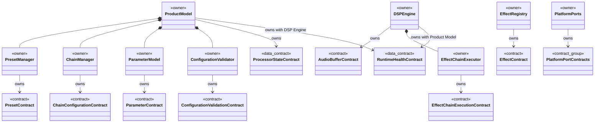
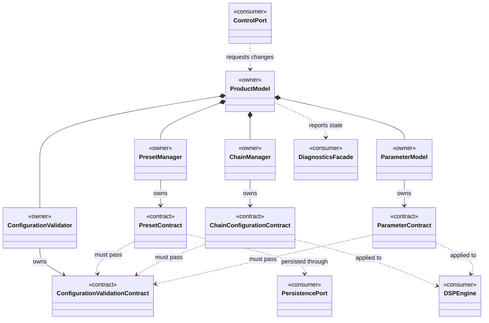
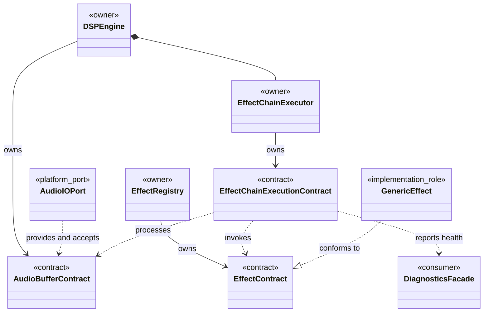
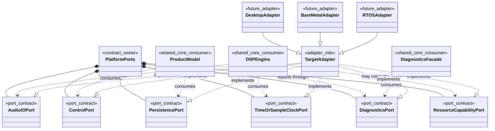

# Interface Contract

## Purpose

The project display name is **SonicFabric**.

This document defines behavior-level interface contracts between the shared SonicFabric components. It does not define C++ signatures, concrete classes, target APIs, memory layout, threading, tasks, interrupts, or deployment details.

These contracts support the architecture principles in [ArchitectureAndDesignPrinciples.md](ArchitectureAndDesignPrinciples.md), the requirements in [ProductAndSoftwareRequirements.md](../requirements/ProductAndSoftwareRequirements.md), the behavior/runtime views in [ArchitectureViews.md](ArchitectureViews.md), the structural views in [StructuralArchitectureViews.md](StructuralArchitectureViews.md), and the shared vocabulary in [Terminology.md](../Terminology.md).

## Contract Ownership Rules

- Product-level contracts belong to the Product Model and describe presets, chains, parameters, validation, and externally observable product state.
- DSP-level contracts belong to the DSP Engine and describe audio buffers, effect execution, effect lifecycle, bypass behavior, and parameter application.
- Platform-level contracts belong to Platform Ports and describe what shared code requires from each target.
- Target adapters implement Platform Ports, but target mechanisms must remain outside shared product and DSP logic.
- Interface contracts should describe required behavior, ownership, invariants, and failure behavior before implementation mechanisms are selected.
- New contracts should reference related `SFAB-*` requirements where traceability is clear.

## Interface Ownership Overview

This diagram shows which shared architecture element owns each interface contract. It is UML-style notation for communication only; it does not define implementation classes.

## Product Contract Relationships

This diagram shows the main product-level contracts and their consumers.

## DSP Contract Relationships

This diagram shows the DSP-level contracts used to process audio through a validated effect chain.

## Platform Port Contract Relationships

This diagram shows how shared code consumes platform ports and target adapters implement them. It keeps target mechanisms outside the shared core.

## Product Model Contracts

### Preset Contract

- **Owner**: Product Model / Preset Manager.
- **Consumers**: Chain Manager, Configuration Validator, Persistence Port, Diagnostics Facade.
- **Related requirements**: `SFAB-PR-004`, `SFAB-PR-005`, `SFAB-PR-008`, `SFAB-SQR-TEST-002`, `SFAB-SQR-REL-001`.

The Preset contract describes saved product configuration. A preset shall contain enough information to restore effect-chain order, effect-slot states, and parameter values without depending on target-specific storage details.

Required behavior:

- A preset can be loaded from a persistence mechanism.
- A preset can be validated before becoming active.
- A valid preset can become the Active Preset.
- An invalid preset shall not replace the current valid configuration.
- Preset recall shall report success or failure through diagnostics or runtime state.

Invariants:

- Preset content represents product state, not storage implementation.
- Preset recall must not require restarting the audio-processing engine.
- Invalid or unsupported preset data must result in defined behavior.

### Chain Configuration Contract

- **Owner**: Product Model / Chain Manager.
- **Consumers**: Configuration Validator, DSP Engine, Effect Registry, Diagnostics Facade.
- **Related requirements**: `SFAB-PR-002`, `SFAB-PR-004`, `SFAB-PR-008`, `SFAB-SQR-MOD-002`, `SFAB-SQR-TEST-002`, `SFAB-SQR-REL-003`.

The Chain Configuration contract describes an ordered effect chain and the state associated with each effect slot.

Required behavior:

- Effects can be enabled, disabled, bypassed, and reordered through validated chain updates.
- Chain order is represented as configuration/data.
- Chain updates are validated before they are applied to the DSP Engine.
- Rejected chain updates shall leave the current valid chain active.
- Chain state changes shall be observable through runtime state or diagnostics.

Invariants:

- Chain order must not be hard-coded into fixed control flow.
- The DSP Engine receives only validated chain configuration.
- A chain update must not corrupt active processing state.

### Parameter Contract

- **Owner**: Product Model / Parameter Model.
- **Consumers**: Configuration Validator, Chain Manager, DSP Engine, Control Port, Diagnostics Facade.
- **Related requirements**: `SFAB-PR-003`, `SFAB-PR-004`, `SFAB-PR-008`, `SFAB-SQR-TEST-002`, `SFAB-SQR-USE-001`.

The Parameter contract describes effect and product parameters in a target-neutral way.

Required behavior:

- Each exposed parameter has a current value.
- Each exposed parameter has metadata sufficient for validation and target presentation.
- Parameter updates are validated before they are applied to active product or DSP state.
- Invalid parameter values shall be rejected, constrained, or mapped using defined product behavior.

Invariants:

- Parameter meaning must be independent of the target control surface.
- Parameter validation must be deterministic.
- Parameter metadata must not require knowledge of target UI widgets or hardware controls.

### Configuration Validation Contract

- **Owner**: Product Model / Configuration Validator.
- **Consumers**: Preset Manager, Chain Manager, Parameter Model, DSP Engine, Diagnostics Facade.
- **Related requirements**: `SFAB-PR-008`, `SFAB-SQR-TEST-002`, `SFAB-SQR-REL-001`, `SFAB-SQR-REL-003`.

The Configuration Validation contract describes the rules for accepting or rejecting product configuration before it affects processing.

Required behavior:

- Presets are checked before recall.
- Chain updates are checked before application.
- Parameter values are checked before use.
- Missing or unavailable effects are detected before the affected configuration becomes active.
- Validation results are observable by the caller and reportable through diagnostics.

Invariants:

- Validation must be deterministic for the same input configuration and available effect set.
- Rejected configuration must not modify the current valid active configuration.
- Validation behavior must be shared across targets unless a target-specific difference is explicitly accepted and documented.

## DSP Engine Contracts

### Audio Buffer Contract

- **Owner**: DSP Engine / Audio Buffer Model.
- **Consumers**: Effect Chain Executor, Generic Effects, Audio I/O Port, tests.
- **Related requirements**: `SFAB-PR-001`, `SFAB-HWR-001`, `SFAB-HWR-003`, `SFAB-SQR-PERF-001`, `SFAB-SQR-PERF-002`, `SFAB-SQR-TEST-001`.

The Audio Buffer contract describes the audio data exchanged between the audio I/O boundary, the DSP Engine, and effects.

Required behavior:

- Audio buffers carry audio samples through the processing path.
- The buffer model supports deterministic processing with known inputs and outputs.
- Buffer ownership and mutation rules shall be explicit before implementation.
- Unsupported sample formats, channel layouts, or buffer sizes shall have defined handling once those policies are selected.

Invariants:

- Audio buffer handling must support bounded real-time processing.
- Audio buffers must be usable in tests without live audio hardware.
- The contract must not depend on a target-specific audio API.

### Effect Contract

- **Owner**: DSP Engine / Effect Registry.
- **Consumers**: Chain Manager, Effect Chain Executor, Configuration Validator, Parameter Model, tests.
- **Related requirements**: `SFAB-PR-002`, `SFAB-PR-003`, `SFAB-SQR-MOD-001`, `SFAB-SQR-MOD-002`, `SFAB-SQR-TEST-001`.

The Effect contract describes a generic processing unit without committing to specific effect types.

Required behavior:

- An effect exposes parameter metadata and accepts validated parameter values.
- An effect can process audio according to its current state.
- An effect participates in a common lifecycle.
- An effect can be used in an effect slot and ordered within an effect chain.
- An effect supports bypass behavior either directly or through chain-level handling.

Invariants:

- Effects are interchangeable through a stable contract.
- Effects must not require target-specific APIs.
- Specific named effects are outside current base architecture scope.

### Effect Chain Execution Contract

- **Owner**: DSP Engine / Effect Chain Executor.
- **Consumers**: Chain Manager, Generic Effects, Diagnostics Facade, tests.
- **Related requirements**: `SFAB-PR-001`, `SFAB-PR-002`, `SFAB-PR-005`, `SFAB-SQR-PERF-003`, `SFAB-SQR-REL-002`, `SFAB-SQR-REL-003`.

The Effect Chain Execution contract describes how a validated chain is applied to audio.

Required behavior:

- The executor processes effects in validated chain order.
- Bypassed effect slots do not alter the audio signal except as defined by the bypass policy.
- Enabled and disabled effect states are handled consistently.
- The executor exposes processing health information needed by diagnostics.
- The executor accepts only validated chain configuration.

Invariants:

- Active processing must avoid unbounded work.
- Runtime control updates must not corrupt active processing state.
- Chain execution must be testable with deterministic audio input.

## Platform Port Contracts

### Audio I/O Port Contract

- **Owner**: Platform Ports.
- **Implemented by**: Target Adapters.
- **Consumers**: DSP Engine.
- **Related requirements**: `SFAB-PR-001`, `SFAB-HWR-001`, `SFAB-SQR-PORT-001`, `SFAB-SQR-PORT-002`.

The Audio I/O Port contract describes the target-neutral audio input and output service required by the DSP Engine.

Required behavior:

- Provide audio input to the DSP Engine.
- Accept processed audio output from the DSP Engine.
- Expose or preserve timing information needed to reason about latency.
- Report audio I/O failures or unsupported operating conditions through defined diagnostics or runtime health behavior.

Invariants:

- The shared DSP Engine must not depend on target-specific audio APIs.
- Audio I/O behavior must support real-time processing expectations.

### Control Port Contract

- **Owner**: Platform Ports.
- **Implemented by**: Target Adapters.
- **Consumers**: Product Model.
- **Related requirements**: `SFAB-PR-002`, `SFAB-PR-003`, `SFAB-PR-005`, `SFAB-HWR-004`, `SFAB-SQR-USE-001`, `SFAB-SQR-USE-002`.

The Control Port contract describes target-neutral control input to the Product Model.

Required behavior:

- Provide control events for preset selection, effect bypass, effect enablement, chain configuration, or parameter editing.
- Preserve product-level meaning independently of physical controls, GUI widgets, MIDI, host automation, or APIs.
- Allow rejected control requests to be reported without changing current valid state.

Invariants:

- Control input must not directly mutate DSP state without product validation.
- Control behavior should remain consistent across targets even if the control surface differs.

### Persistence Port Contract

- **Owner**: Platform Ports.
- **Implemented by**: Target Adapters.
- **Consumers**: Preset Manager.
- **Related requirements**: `SFAB-PR-004`, `SFAB-PR-005`, `SFAB-HWR-005`, `SFAB-SQR-PORT-001`, `SFAB-SQR-TEST-002`.

The Persistence Port contract describes target-neutral storage and retrieval of preset data.

Required behavior:

- Load stored preset data when requested by the Preset Manager.
- Store preset data when preset saving is in scope.
- Report missing, invalid, unavailable, or unsupported stored data through defined product behavior.

Invariants:

- Persistence mechanisms must not leak into preset semantics.
- Preset data must be validated before becoming active.
- A persistence failure must not corrupt the active preset or active chain configuration.

### Time Or Sample-Clock Port Contract

- **Owner**: Platform Ports.
- **Implemented by**: Target Adapters.
- **Consumers**: DSP Engine, Product Model when timing behavior is required.
- **Related requirements**: `SFAB-HWR-001`, `SFAB-SQR-PERF-001`, `SFAB-SQR-PERF-002`, `SFAB-SQR-PORT-001`.

The Time Or Sample-Clock Port contract describes target-neutral timing information needed by shared behavior.

Required behavior:

- Provide timing or sample-clock information required to reason about audio processing.
- Support future timing-sensitive features if they are promoted into scope.
- Report unavailable or unsupported timing capabilities through defined behavior.

Invariants:

- Timing behavior must not bind shared logic to one scheduler, interrupt model, audio API, or operating system.
- Timing services used by the real-time path must preserve bounded execution.

### Diagnostics Port Contract

- **Owner**: Platform Ports.
- **Implemented by**: Target Adapters.
- **Consumers**: Diagnostics Facade, Product Model, DSP Engine.
- **Related requirements**: `SFAB-PR-006`, `SFAB-HWR-006`, `SFAB-SQR-PERF-003`, `SFAB-SQR-REL-001`, `SFAB-SQR-USE-001`.

The Diagnostics Port contract describes target-neutral reporting of runtime state, errors, health, logging, and tracing.

Required behavior:

- Report active preset, chain configuration, processing health, rejected updates, validation failures, and fault/fallback state where applicable.
- Allow target adapters to expose diagnostics using target-appropriate mechanisms.
- Preserve real-time constraints when diagnostics are triggered from or near the audio path.

Invariants:

- Diagnostics must not require blocking I/O, unbounded work, or target-specific APIs in shared real-time processing.
- Diagnostic reporting must not corrupt product or DSP state.

### Resource Capability Port Contract

- **Owner**: Platform Ports.
- **Implemented by**: Target Adapters.
- **Consumers**: Product Model, DSP Engine, Configuration Validator when resource policies are defined.
- **Related requirements**: `SFAB-HWR-002`, `SFAB-HWR-003`, `SFAB-HWR-007`, `SFAB-HWR-008`, `SFAB-SQR-PERF-002`, `SFAB-SQR-PORT-002`.

The Resource Capability Port contract describes target-neutral access to resource capability information when shared behavior needs it.

Required behavior:

- Expose resource capability information required by validation, diagnostics, or processing health.
- Support target-specific resource constraints without changing common product behavior.
- Report unavailable capability information through defined fallback behavior.

Invariants:

- Resource reporting must not force shared code to know target hardware details.
- Desktop capability reporting should remain minimal unless required by product behavior.
- Bare metal and RTOS capability reporting may become more detailed in target-specific requirements.

## Data Contracts

### Runtime Health Contract

- **Owner**: Product Model / DSP Engine.
- **Consumers**: Diagnostics Facade, Diagnostics Port, Control Port, tests.
- **Related requirements**: `SFAB-PR-006`, `SFAB-PR-008`, `SFAB-SQR-REL-001`, `SFAB-SQR-REL-002`, `SFAB-SQR-USE-001`.

The Runtime Health contract describes observable processing and configuration health.

Required behavior:

- Represent whether the processor is operating normally, rejecting invalid input, or handling a fault/fallback condition.
- Support reporting without requiring target-specific diagnostics mechanisms.
- Support deterministic tests for invalid configuration and rejected update behavior.

Invariants:

- Runtime health is observable state, not a target-specific logging format.
- Health reporting must not destabilize real-time audio processing.

### Processor State Contract

- **Owner**: Product Model.
- **Consumers**: DSP Engine, Control Port, Diagnostics Facade, tests.
- **Related requirements**: `SFAB-PR-005`, `SFAB-PR-006`, `SFAB-PR-008`, `SFAB-SQR-REL-001`, `SFAB-SQR-REL-003`.

The Processor State contract describes lifecycle states such as uninitialized, configured, running, stopped, and fault/fallback.

Required behavior:

- Define allowed state transitions.
- Reject or report invalid transitions.
- Preserve the current valid configuration when a requested transition fails.
- Expose state changes through diagnostics or runtime state.

Invariants:

- State transitions must be deterministic.
- Fault/fallback behavior must be defined before target-specific failure handling is implemented.

## Deferred Target-Specific Interfaces

Target-specific interfaces are deferred until target requirements are defined. Future target-specific documents may refine how each target implements the common port contracts, including:

- Desktop audio API and filesystem integration.
- Bare metal audio codec, peripheral, memory, clocking, and debug interfaces.
- RTOS task, queue, timing, watchdog, and diagnostics interfaces.

Target-specific interfaces must not redefine common product behavior unless the difference is explicitly accepted and documented.
